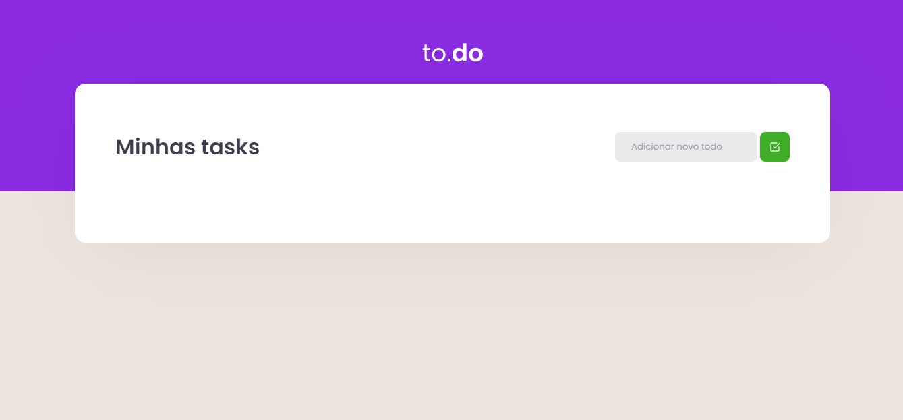
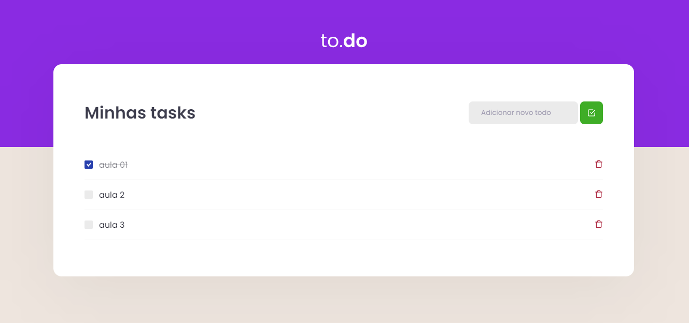

## Começando

Primeiro, execute o servidor de desenvolvimento:

```bash
npm install
# or
yarn install
```

Para executar o projeto:

```bash
npm run dev
# or
yarn dev
```

Abra (http: // localhost: 8080) com seu navegador para ver o resultado.

## Informações e Screens

Projeto de listagem de repositorios da rocketseat pela api do github



